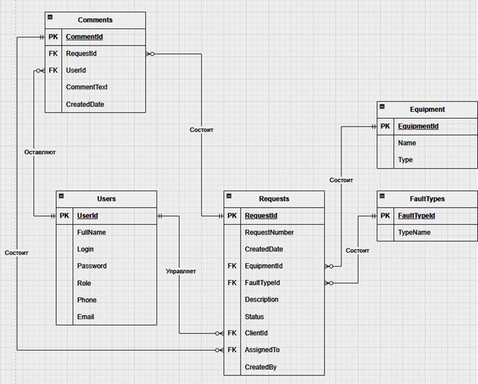
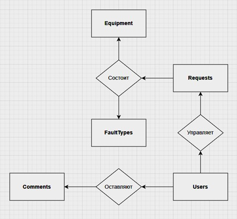
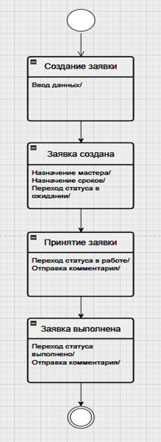
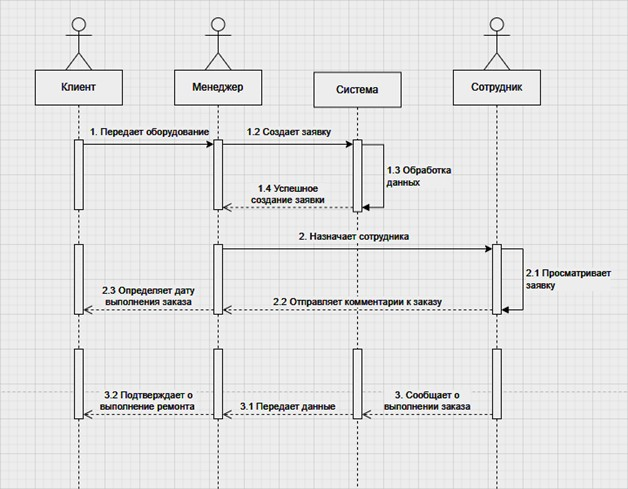
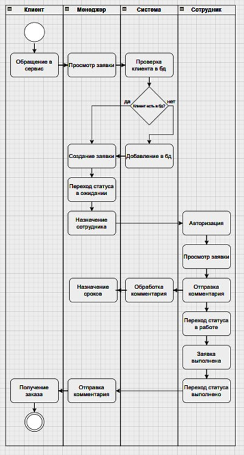
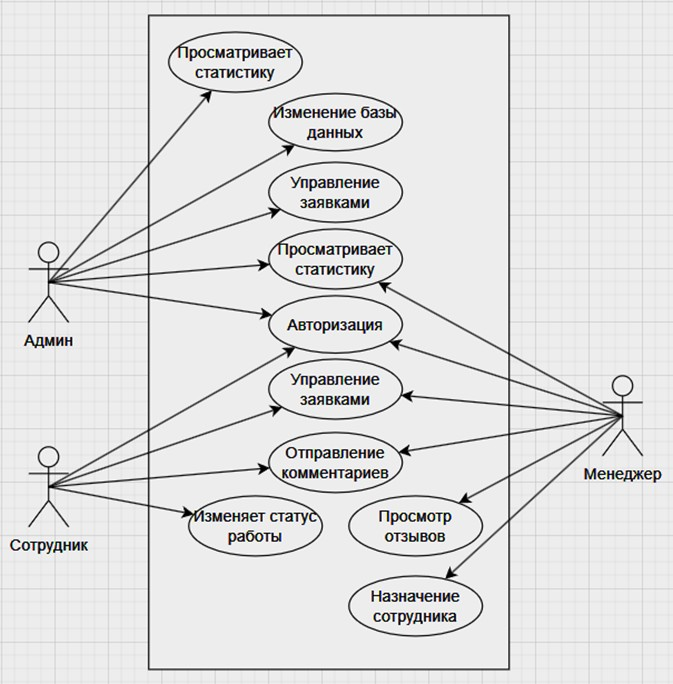

# 🔧 Service Center Management System

**Graduation Project**  
*Information Systems and Programming*

---

## 📌 Overview

**ServiceCenter** is a desktop application designed to automate the workflow of a service center. It provides a complete solution for managing repair requests, from client registration to task completion and feedback collection.

The system supports multiple user roles:
- **Client**: Create and track own repair requests.
- **Manager**: Oversees all requests, assigns tasks.
- **Master (Technician)**: Updates statuses, communicates via comments.
- **Employee**: Supports the team.

---

## ✨ Key Features

- Multi-role Authentication
- Full CRUD for repair requests
- Status tracking (Awaiting → In Progress → Completed)
- Assignment system for employees
- Comments & history per request
- QR Code generation for feedback forms
- Statistics dashboard for managers

---

## 🛠️ Tech Stack

| Component       | Technology |
|-----------------|------------|
| UI Framework    | WPF, XAML |
| Language        | C# (.NET Framework) |
| Database        | MS SQL Server (ADO.NET) |
| QR Generation   | QRCoder library |
| Version Control | Git |

---

## 🚀 How to Run the Project

1. Clone the repository:
   ```bash
   git clone https://github.com/CSharpInvokeR/ServiceCenter.git
   ```

2. Open `ServiceCenter.sln` in Visual Studio.

3. **Database setup:**
   - Run the SQL script from `Database/ServiceCenter.sql` in SSMS to create the database and tables.
   - Create `appsettings.json` in the root folder (use `appsettings.example.json` as template) and set your connection string.

4. Build and run (`F5`).

---

## 📁 Project Structure

```
ServiceCenter/
├── Database/                  # SQL scripts
│   └── ServiceCenter.sql      # Database schema with test data
├── Models/                    # Data models (Zayavka, Polzovatel, etc.)
├── Services/                  # Core services (DatabaseService, ConfigHelper)
├── Views/                     # WPF windows (LoginWindow, MainWindow, RequestWindow)
├── Converters/                # XAML value converters
├── Resources/                 # Icons, images
├── App.xaml                   # Application resources
├── appsettings.example.json   # Template for config
├── .gitignore                 # Ignored files
└── README.md                  # This file
```

---

## 📬 Contact

- **GitHub:** [CSharpInvokeR](https://github.com/CSharpInvokeR)

---

## 🇷🇺 Русский

### 📌 Описание

**ServiceCenter** — десктопное приложение для автоматизации работы сервисного центра. Управление заявками на ремонт: от регистрации клиента до завершения работы и сбора обратной связи.

Роли:
- **Клиент:** Создание и отслеживание своих заявок.
- **Менеджер:** Управление всеми заявками, назначение исполнителей.
- **Мастер:** Обновление статусов, комментарии.
- **Сотрудник:** Поддержка команды.

---

### ✨ Возможности

- Вход по ролям
- Полный CRUD для заявок
- Статусы: "В ожидании" → "В работе" → "Выполнено"
- Назначение исполнителей
- Комментарии и история по заявке
- Генерация QR-кода для формы обратной связи
- Статистика для менеджера

---

### 🛠️ Технологии

| Компонент       | Технология |
|-----------------|------------|
| Интерфейс       | WPF, XAML |
| Язык            | C# (.NET Framework) |
| База данных     | MS SQL Server (ADO.NET) |
| QR-коды         | Библиотека QRCoder |
| Контроль версий | Git |

---

### 🚀 Как запустить

1. Клонируйте репозиторий:
   ```bash
   git clone https://github.com/CSharpInvokeR/ServiceCenter.git
   ```

2. Откройте `ServiceCenter.sln` в Visual Studio.

3. **Настройка БД:**
   - Выполните скрипт из `Database/ServiceCenter.sql` в SSMS.
   - Создайте `appsettings.json` по шаблону `appsettings.example.json`, укажите строку подключения.

4. Соберите и запустите (`F5`).

---

### 📁 Структура проекта

```
ServiceCenter/
├── Database/                  # SQL-скрипты
│   └── ServiceCenter.sql      # Схема БД с тестовыми данными
├── Models/                    # Модели данных (Zayavka, Polzovatel...)
├── Services/                  # Сервисы (DatabaseService, ConfigHelper)
├── Views/                     # Окна WPF (LoginWindow, MainWindow, RequestWindow)
├── Converters/                # Конвертеры XAML
├── Resources/                 # Иконки, изображения
├── App.xaml                   # Ресурсы приложения
├── appsettings.example.json   # Шаблон конфига
├── .gitignore                 # Игнорируемые файлы
└── README.md                  # Этот файл
```

---

### 📬 Контакты

- **GitHub:** [CSharpInvokeR](https://github.com/CSharpInvokeR)

---

## 📐 Диаграммы системы

### ER-диаграмма (схема базы данных)


### Концептуальная модель


### Диаграмма состояний (жизненный цикл заявки)


### Диаграмма последовательности


### Диаграмма деятельности


### Диаграмма вариантов использования


---
